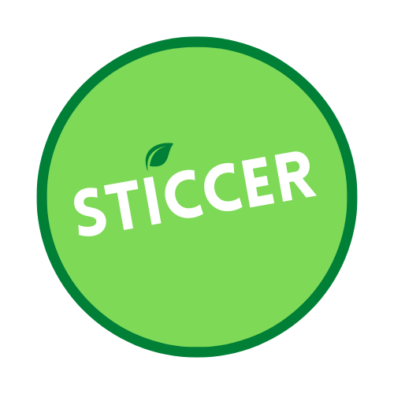

# sticcer


STICCER: Sustainable Tech Insights and Cloud Carbon Efficiency Reporting


Start Prometheus and friends to monitor containers with label sticcer=GROUP_NAME.
Use [my dockprom fork](https://github.com/mtpatter/dockprom) for Docker for Mac.

```
$ cd PATH_TO_GITHUB_REPO/dockprom
$ docker-compose up
```

Build image for STICCER (based on Dash.)
```
$ docker build -t dash -f Dockerfile.dash .
```

Run the dashboard on port 8050 (locally with Docker for Mac):

```
docker run -it --rm --add-host=host.docker.internal:host-gateway \
    -p 8050:8050 -v $PWD:/dash \
    --label sticcer=dashgroup \
    dash python sticcer.py -f sticcer-config.json
```
